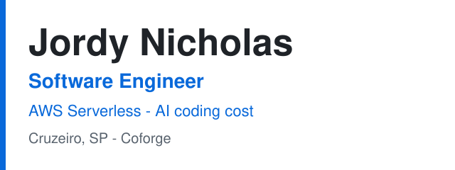

<picture>
  <source media="(prefers-color-scheme: dark)" srcset="assets/header-dark.svg">
  
</picture>

Engenheiro de software pleno na Coforge, na continuidade do trabalho iniciado na Encora. Construo com TypeScript (Node.js), Java e AWS serverless, e ferramentas que reduzem o custo de tokens em fluxos de agentes de código.

Mid-level software engineer at Coforge, continuing the work started at Encora. I build with TypeScript (Node.js), Java, and AWS serverless, and tools that cut token cost in coding-agent workflows.

**10.000+ execuções** do Step Functions encerradas · **PostgreSQL 15.12 → 17.7** no Aurora, sem downtime · [**TokenForge**](https://github.com/JordyNicholas/TokenForge)

[LinkedIn](https://www.linkedin.com/in/jordy-nicholas) · [jordyncdasilva@live.com](mailto:jordyncdasilva@live.com) · [Português](#português) · [English](#english)

---

## Português

Antes do software, fui iAdvocate no time de inovação da Maxion Wheels em Cruzeiro, com prêmios consecutivos de time da planta.

### O que já foi para produção

- Encerrei mais de 10.000 execuções travadas do Step Functions com uma arquitetura recursiva em Lambda, depois de um gargalo de concorrência na conta AWS.
- Planejei e executei o upgrade de PostgreSQL 15.12 para 17.7 no RDS Aurora sem downtime, com deploy Blue/Green.
- Na Coforge, entrego pipeline de exportação de dados sensíveis, Lambda Authorizer para integrações com terceiros e o ciclo de vida de artefatos de CI/CD no JFrog Artifactory.

### Onde começar

1. [TokenForge](https://github.com/JordyNicholas/TokenForge) — produto pessoal em atividade. FinOps de agentes de código: estima contexto caro, grava instruções no formato de cada ferramenta e mostra tokens antes e depois.
2. [ts-monolith](https://github.com/JordyNicholas/ts-monolith) e [nextjs-boilerplate](https://github.com/JordyNicholas/nextjs-boilerplate) — base de referência, não um produto em produção. API em monólito modular e o console Next.js que consome o contrato OpenAPI gerado.
3. Repositórios de curso (Pokedex, DIO, labs do Santander) são arquivo de estudo. O ponto de partida é o TokenForge.

| Projeto | O que faz | Stack |
| --- | --- | --- |
| [TokenForge](https://github.com/JordyNicholas/TokenForge) | Token Risk → Policy Pack → Savings Proof. CLI, extensão do VS Code e dashboard em React, com adaptadores para Copilot, Cursor e Claude. | TypeScript, React |
| [ts-monolith](https://github.com/JordyNicholas/ts-monolith) | Monólito modular com autenticação multi-tenant, fila e contrato OpenAPI. | Fastify, Prisma, PostgreSQL |
| [nextjs-boilerplate](https://github.com/JordyNicholas/nextjs-boilerplate) | Console que consome os tipos gerados desse contrato, com sessão opcional em cookie httpOnly. | Next.js, TypeScript |

O que o TokenForge faz, em três passos

<ol>
<li><strong>Token Risk.</strong> Varre o repositório e marca contexto caro e de pouco valor.</li>
<li><strong>Policy Pack.</strong> Gera instruções e exclusões no formato de cada ferramenta (Copilot, Cursor, Claude).</li>
<li><strong>Savings Proof.</strong> Publica um relatório de tokens antes/depois para o dashboard.</li>
</ol>

O modo padrão é heurístico, sem chamar um modelo. O enriquecimento com LLM é opcional.

### Em construção

[Specwright](https://github.com/JordyNicholas/Specwright) — sistema multiagente que transforma intenção de produto em um SpecPack citado (requisitos, opções de arquitetura, riscos, outline de implementação). Status real: unidade U0, só o scaffold e o `/health`. Agentes e RAG entram nas unidades seguintes.

### Como eu trabalho

- Mudança em produção com caminho de volta: Blue/Green no banco, e desenho explícito quando o limite é concorrência da conta.
- Testes em volta de contrato e de lógica compartilhada. No TokenForge, o relatório de scan é o contrato entre CLI, extensão e dashboard.
- Documento o trade-off quando a decisão não é óbvia. O modo padrão do TokenForge não chama modelo de propósito.

### Stack

| | |
| --- | --- |
| Linguagens | TypeScript, JavaScript, Java, Python |
| Backend | Node.js, Spring Boot, Fastify, Prisma |
| Frontend | React, Next.js |
| Cloud | AWS Lambda, API Gateway, Step Functions, SQS, RDS Aurora, S3, CloudFormation, CDK |
| Dados | PostgreSQL, DynamoDB, MySQL |
| Testes | Jest, Vitest |

Formação e certificações

<ul>
<li>Pós-graduação Lato Sensu em Engenharia de Software — PUC Minas (2024–2025)</li>
<li>Bacharelado em Engenharia da Computação — UNISAL (2019–2023)</li>
<li>General Standard Course, Inglês C1 (CEFR) — Bayswater (2023)</li>
<li>AWS Certified Cloud Practitioner — emitida em fevereiro de 2025, válida até fevereiro de 2028</li>
<li>Trilha de IA generativa — DeepLearning.AI e Coursera (2025): fundamentos, desenho de software com IA e engenharia de software em time com IA</li>
<li>Santander Coders — Java + Angular (DIO, 2023) e trilha web back-end (Ada Tech, 2023)</li>
</ul>

Português nativo · Inglês fluente (C1)

Se você está contratando para backend, serverless ou ferramentas de desenvolvimento, comece pelo TokenForge e pelos três itens de produção acima. [LinkedIn](https://www.linkedin.com/in/jordy-nicholas) · [jordyncdasilva@live.com](mailto:jordyncdasilva@live.com)

Fora do código, converso sobre esporte, jogos, música e viagem. [Instagram](https://instagram.com/jordynicholas)

[English](#english)

---

## English

Before software, I was an iAdvocate on the innovation team at Maxion Wheels in Cruzeiro, with consecutive plant team awards.

### What has shipped

- Cleared 10,000+ stuck Step Functions executions with a recursive Lambda architecture, after an account-level concurrency bottleneck.
- Planned and ran a PostgreSQL upgrade from 15.12 to 17.7 on RDS Aurora with no downtime, using Blue/Green deployments.
- At Coforge I deliver a sensitive-data export pipeline, a Lambda Authorizer for third-party integrations, and CI/CD artifact lifecycle management in JFrog Artifactory.

### Where to start

1. [TokenForge](https://github.com/JordyNicholas/TokenForge) — personal project, actively developed. Coding-agent FinOps: it scores expensive context, writes instructions in each tool’s format, and shows tokens before and after.
2. [ts-monolith](https://github.com/JordyNicholas/ts-monolith) and [nextjs-boilerplate](https://github.com/JordyNicholas/nextjs-boilerplate) — a personal reference stack, not a production product. A modular-monolith API and the Next.js console that consumes the generated OpenAPI contract.
3. Course repositories (Pokedex, DIO, Santander labs) are a study archive. Start with TokenForge.

| Project | What it does | Stack |
| --- | --- | --- |
| [TokenForge](https://github.com/JordyNicholas/TokenForge) | Token Risk → Policy Pack → Savings Proof. A CLI, a VS Code extension, and a React dashboard, with adapters for Copilot, Cursor, and Claude. | TypeScript, React |
| [ts-monolith](https://github.com/JordyNicholas/ts-monolith) | Modular monolith with multi-tenant auth, a queue, and an OpenAPI contract. | Fastify, Prisma, PostgreSQL |
| [nextjs-boilerplate](https://github.com/JordyNicholas/nextjs-boilerplate) | Console that consumes the generated types from that contract, with an optional httpOnly-cookie session. | Next.js, TypeScript |

What TokenForge does, in three steps

<ol>
<li><strong>Token Risk.</strong> Scans a repository and flags expensive, low-value context.</li>
<li><strong>Policy Pack.</strong> Writes instructions and exclusions in each tool’s format (Copilot, Cursor, Claude).</li>
<li><strong>Savings Proof.</strong> Publishes a before/after token report for the dashboard.</li>
</ol>

The default mode is heuristic and does not call a model. LLM enrichment is optional.

### Currently building

[Specwright](https://github.com/JordyNicholas/Specwright) — a multi-agent system that turns product intent into a cited SpecPack (requirements, architecture options, risks, implementation outline). Honest status: unit U0, scaffold and `/health` only. Agents and RAG land in later units.

### How I work

- Production changes ship with a way back: Blue/Green on the database, and an explicit design when the limit is account concurrency.
- Tests sit around contracts and shared logic. In TokenForge, the scan report is the contract between the CLI, the extension, and the dashboard.
- I write down the trade-off when the decision is not obvious. TokenForge’s default mode does not call a model on purpose.

### Stack

| | |
| --- | --- |
| Languages | TypeScript, JavaScript, Java, Python |
| Backend | Node.js, Spring Boot, Fastify, Prisma |
| Frontend | React, Next.js |
| Cloud | AWS Lambda, API Gateway, Step Functions, SQS, RDS Aurora, S3, CloudFormation, CDK |
| Data | PostgreSQL, DynamoDB, MySQL |
| Testing | Jest, Vitest |

Education and certifications

<ul>
<li>Lato Sensu postgraduate degree, Software Engineering — PUC Minas (2024–2025)</li>
<li>Bachelor’s degree, Computer Engineering — UNISAL (2019–2023)</li>
<li>General Standard Course, C1 English (CEFR) — Bayswater (2023)</li>
<li>AWS Certified Cloud Practitioner — issued February 2025, valid through February 2028</li>
<li>Generative AI path — DeepLearning.AI and Coursera (2025): foundations, AI-powered software design, and team software engineering with AI</li>
<li>Santander Coders — Java + Angular (DIO, 2023) and web back-end track (Ada Tech, 2023)</li>
</ul>

Portuguese: native · English: fluent (C1)

If you are hiring for backend, serverless, or developer-tooling roles, start with TokenForge and the three production notes above. [LinkedIn](https://www.linkedin.com/in/jordy-nicholas) · [jordyncdasilva@live.com](mailto:jordyncdasilva@live.com)

Outside of code I talk about sports, games, music, and travel. [Instagram](https://instagram.com/jordynicholas)

[Português](#português)
